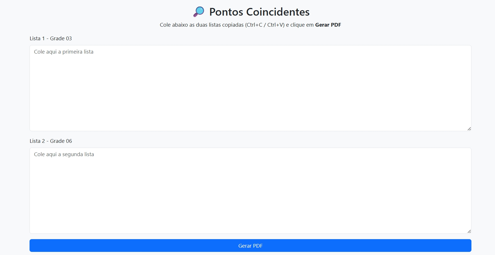

# 📝 Comparador de Endereços — Gerador de PDF

Aplicação web simples e eficiente desenvolvida em **Flask (Python)** para comparar duas listas de endereços informadas pelo usuário e gerar automaticamente um **PDF** contendo:

- ✔️ Itens que existem apenas na **Lista 1**
- ✔️ Itens que existem apenas na **Lista 2**
- ✔️ Itens que aparecem **em ambas** as listas
- ✔️ Diferenças destacadas e organizadas

A ferramenta é ideal para uso corporativo, conferências operacionais, validação de listas, auditorias e atividades internas que exigem comparação rápida entre conjuntos de dados.

---

## 🖼️ Tela Inicial

<p align="center">
  
</p>

---

## 🚀 Acesso à Aplicação

A aplicação pode ser utilizada localmente ou hospedada em serviços como **Render**, **Railway**, **Fly.io** ou **Heroku**.

---

## ⚙️ Funcionalidades Principais

- 📋 **Entrada manual** das listas via área de texto
- 🔍 **Comparação automática** dos itens
- 🆚 Identificação de:
  - Itens exclusivos da **Lista 1**
  - Itens exclusivos da **Lista 2**
  - Itens presentes **nas duas listas**
- 🖨️ **Geração automática de PDF** com formatação organizada
- 🎨 Interface simples, limpa e responsiva (**Bootstrap**)

---

## 🧩 Tecnologias Utilizadas

| Camada | Tecnologia |
|--------|-------------|
| Backend | Flask (Python) |
| Frontend | HTML5, CSS3, Bootstrap 5 |
| Geração de PDF | reportlab |
| Deploy (opcional) | Render, Railway, Heroku |

---

## 📄 Estrutura de Pastas

```bash
Comparador-Enderecos/
│
├── static/
│   └── (arquivos estáticos opcionais)
│
├── templates/
│   └── index.html        # Interface principal
│
├── app.py                # Código da aplicação Flask
├── imagem1.jpeg          # Captura da tela inicial
├── requirements.txt       # Dependências do projeto
└── README.md              # Este arquivo
```

---

## 🧠 Como Usar

1. Cole a **Lista 1** no primeiro campo.
2. Cole a **Lista 2** no segundo campo.
3. Clique em **Gerar PDF**.
4. O sistema processará as listas e retornará um arquivo PDF contendo:
   - Exclusivos da Lista 1
   - Exclusivos da Lista 2
   - Itens presentes em ambas

---

## 🧪 Como Executar Localmente

### 1. Clone o repositório

```bash
git clone https://github.com/seuusuario/comparador-listas.git
cd comparador-listas
```

### 2. Crie um ambiente virtual (opcional)

```bash
python -m venv venv
source venv/bin/activate   # Linux/Mac
venv\Scripts\activate      # Windows
```

### 3. Instale as dependências

```bash
pip install -r requirements.txt
```

### 4. Execute o servidor

```bash
python app.py
```

Acesse no navegador:  
👉 **http://127.0.0.1:5000**

---

## 🧾 Exemplo de Entrada

**Lista 1:**
```
Rua A
Rua B
Rua C
```

**Lista 2:**
```
Rua B
Rua C
Rua D
```

O PDF exibirá:

- ✔️ Exclusivos da Lista 1 → Rua A  
- ✔️ Exclusivos da Lista 2 → Rua D  
- ✔️ Presentes em ambas → Rua B, Rua C  

---

## 📦 Dependências

Arquivo `requirements.txt` recomendado:

```
Flask
reportlab
```

---

## ✨ Melhorias Futuras

- Exportação em Excel
- Comparação inteligente (ignorando acentos e caixa)
- Upload de arquivos `.txt` e `.csv`
- Marcação visual de diferenças (diff)

---

## 📬 Contato

Desenvolvido por **Douglas Francisco da Silva**  
📧 d3lsempre@gmail.com  
💼 www.linkedin.com/in/douglas-francisco-da-silva-51953435a

---

© DFS 2025 — Todos os direitos reservados.
